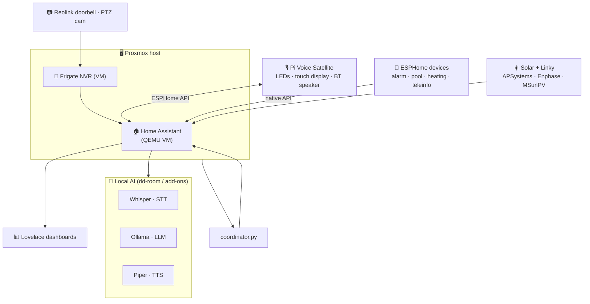
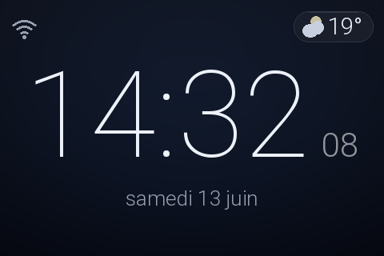
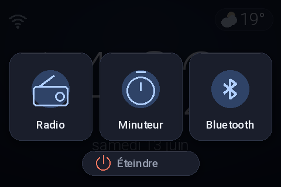
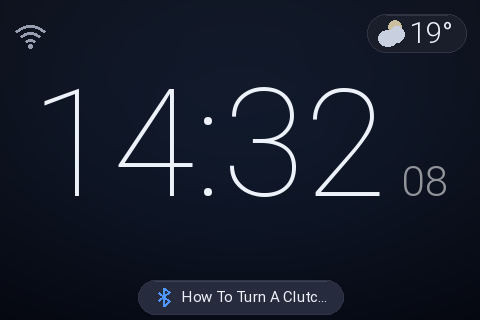
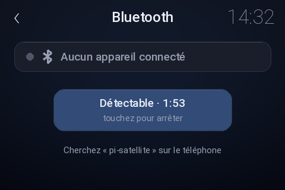

# 🏡 ha-config — a fully-local smart home

A complete, **100 % local** Home Assistant setup for one house: Lovelace dashboards,
automations, ESPHome firmware, an energy/solar stack, a Proxmox data coordinator,
and a hand-built **Raspberry Pi voice satellite** with a touch display. No cloud,
no subscriptions, no data leaving the LAN — every voice query, every sensor, every
automation runs on hardware in the house.


> **Heads-up:** this is a personal home's living configuration, shared for reference
> and inspiration — not a turnkey template. Hostnames (`dd-ha`), entity IDs, and the
> French UI are specific to this install. Secrets (`*.token`, `secrets.yaml`) are
> gitignored and never committed.

---

## ✨ Highlights

- 🎙️ **Local voice assistant** — a Raspberry Pi 4 satellite running Whisper (STT),
  Ollama (LLM) and Piper (TTS) entirely on a home server. Custom LED ring, a
  480×320 touch UI, and a **Bluetooth speaker mode** that works offline on battery.
- ☀️ **Solar + grid energy** — APSystems, Enphase Envoy and an MSunPV inverter fused
  with a Linky smart meter (teleinfo) into consumption/cost sensors on a time-of-use
  tariff.
- 🖥️ **Proxmox coordinator** — a Python coordinator surfaces VE node/VM/disk health
  straight into Home Assistant.
- 🔌 **ESPHome everywhere** — pool relay, alarm panel bridge, heating, and the
  satellite's ESP32, all flashed from the repo.
- 📊 **Eight Lovelace dashboards** deployed straight to the live instance with one
  script.
- 🛡️ **Security & cameras** — Bentel alarm over ESPHome, Reolink doorbell + Frigate
  NVR, PTZ garage camera.

---

## 🧭 Architecture

Everything orbits a single Home Assistant instance (`dd-ha`) running as a QEMU VM on
Proxmox. Nothing talks to the internet.



---

## 🎙️ The voice satellite

A from-scratch voice assistant built on a Raspberry Pi 4 and the
[linux-voice-assistant](https://github.com/OHF-Voice/linux-voice-assistant) runtime —
INMP441 mic, MAX98357A amp, a WS2812B status ring, and a 4" **ST7796S 480×320 touch
display** driven by a custom SPI driver and a Pillow render loop. Full build notes
live in [`satellite/`](satellite/README.md) and [`satellite/CLAUDE.md`](satellite/CLAUDE.md).

| Ambient clock | Quick menu | Now playing | Bluetooth pairing |
|:---:|:---:|:---:|:---:|
|  |  |  |  |

**What it does**

- Wake-word ("Hey Jarvis") → local STT → Ollama → Piper TTS, no cloud round-trip.
- A calm full-bleed clock that shifts colour and grows a voice waveform while
  listening/speaking; a single dirty-rectangle blit keeps idle CPU near zero.
- Touch control of **radio** (6 stations via Music Assistant) and **timers**, with
  optimistic UI that reconciles against HA.
- 🆕 **Bluetooth A2DP speaker mode** — pair a phone or laptop from the touch screen,
  audio mixes through PipeWire to the I2S amp, and the home screen shows the live
  track title. Works fully offline for portable/battery use.

---

## 🗂️ Repository layout

```
ha-config/
├── dashboard_*.yaml        — 8 Lovelace dashboards (home, controle, alarm,
│                             piscine, proxmox, temp, video, 3dprint, interphone)
├── automations/            — Home Assistant automations
├── scripts.yaml            — radio, PTZ camera, alarm, schedule helpers
├── sensors_*.yaml          — template / history_stats / wind / disk sensors
├── push_dashboards.py      — deploy dashboards to dd-ha via the HA REST API
├── coordinator.py          — Proxmox VE data coordinator → HA
├── ha_history_service.py   — entity history → voice-friendly summaries
├── ha_ws.py                — small HA WebSocket helper
├── esphome/                — ESPHome device configs (subtree)
│                             satellite · teleinfo · alarm · pool · heating
└── satellite/              — Raspberry Pi voice assistant (subtree)
    ├── src/                — LED + display + Bluetooth daemons (Python)
    ├── systemd/            — service units
    ├── wakeword_training/  — microWakeWord training scripts
    └── case/               — 3D-printed enclosure (OpenSCAD)
```

---

## 🧰 Tech stack

| Domain | Tools |
|--------|-------|
| Core | Home Assistant on Proxmox VE (QEMU) |
| Local AI | Whisper · Ollama · Piper · openWakeWord |
| Audio/media | Music Assistant · PipeWire · mpv |
| Devices | ESPHome · Matter · Zigbee · BLE (Xiaomi ATC) · rtl_433 |
| Energy | APSystems · Enphase Envoy · MSunPV · Linky (teleinfo) |
| Cameras | Reolink · Frigate · go2rtc |
| Messaging | Mosquitto MQTT |
| Satellite | RPi 4 · INMP441 · MAX98357A · WS2812B · ST7796S touch |

---

## 🚀 Deploying changes

Dashboards are pushed to the running instance over the REST API:

```bash
python3 push_dashboards.py        # needs .ha_token (gitignored)
```

ESPHome devices are flashed via the ESPHome add-on on `dd-ha` or locally
(`esphome run <device>.yaml`). The satellite syncs over `rsync` + `systemctl`
restart — see [`satellite/CLAUDE.md`](satellite/CLAUDE.md).

---

## 🔐 Security

No cloud APIs, no hard-coded IPs (hostnames only), and all credentials
(`.ha_token`, `secrets.yaml`, `*.token`) are gitignored. The voice pipeline,
including the LLM, runs on local hardware.
